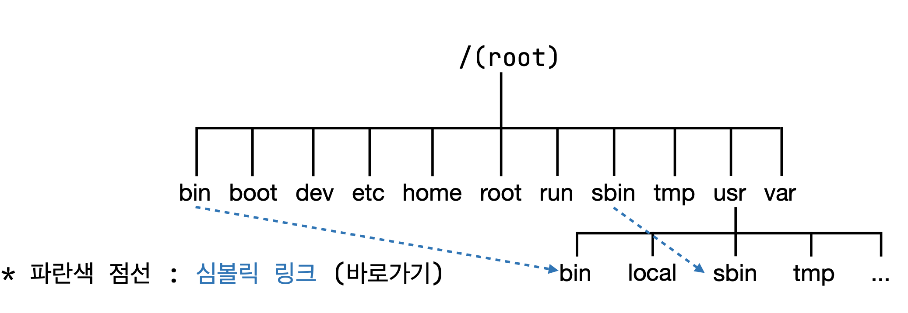

# Linux
## Linux?

핀란드 헬싱키 대학교의 학생이었던 리누스 토발즈가 처음 개발

MINIX를 참조

   

- RedHat
→ RHEL : 유료
→ CentOS : RHEL을 무료로
→ Fedora : 빠른 업데이트, 낮은 안정성
- Debian 계열
→ Devian : server, embeded에 주로 사용
→Ubuntu : Debian에 편의성 추가
- SuSE 
Suse : 유럽에서 많이 사용
- POSIZ ( Portable Operating System Interface ) : OS표준
- LSB ( Linux Standard Bse ) : Linux 표준
- POSIX 표준에 맞추고, 일부 확장
- file system 계층 등의 구조를 표준화

## file system

: 단일 디렉토리 트리로 구성

   

- /bin : binary (실행파일 등)
- /sbin : system (or superuser) binary (관리자를 위한 실행파일 등)
- /boot : booting과 관련된 파일 (bootloader, 커널 등)
- /dev : device. 각종 장치 파일 등 (cd rom 등"..)
- /etc : 주요 설정. 시스템 환경 설정 등 (ex. /etc/hosts = dns 역할)
- /home : 개인 사용자 디렉토리
- /root : 관리자의 home 디렉토리
- /run : 실행 정보 파일
- /tmp : temporary. 임시 파일 (잠시 만들어지고 사라지는 파일들)
- /usr : 작은 root (/usr/local = 일반적인 오픈소스 기본 설치 디렉토리)
- /var : variable (log파일 등)

## 사용자 관리

비밀번호가 없는 사용자는 사용 불가   
superuser로 로그인 하는 것은 지양    
/etc/sudoers 파일을 이용하여 특정 사용자에게 관리 명령 부여 가능    
/var/log/secure 파일에 sudo 명령  logging   
한 사용자가 여러 개의 그룹에 포함 가능    

```html
su [사용자명] (switch user) : 해당 사용자로 변경(관리자의 비밀번호 필요)   
sudo [명령어] (superuser do): 관리자 권한으로 실행 관리자가 sudo 사용하도록 허용해야 함   
id [사용자명] : 사용자 정보 확인   
passwd [사용자명] : 사용자 비밀번호 설정    
useradd [사용자명] : 사용자 생성    
usermod [option] [사용자명] : 사용자 정보 수정   
userdel [-r] [사용자명] : 사용자 삭제   
```

   


## file

파일 권한 관리

**d : directory   
r : read    
w : write     
x : execute**


ex) drwxr-xr"- : directory이고,   
해당 파일을 생성한 사용자는 모든 권한을,    
생성자와 같은 그룹의 사용자는 읽기와 실행 권한을, 타그룹 사용자는 읽기 권한을 가진다.   

**chmod [option] [filename]**   
-숫자로 한번에 추가/삭제가능   

```html

ex) chmod 777 test1 : -rwxrwxrwx
    chmod 700 test1 : -rwx------
    chmod 755 test1 : -rwxr-xr-x
```

**chown [옵션] [owner][:group] [파일명]**

```html
cp file1 file2 : file 복사
mv file1 file2 : file 이동 (변경)
rm file1 : file  삭제
kdir dir1 : 디렉토리 생성
cp -r dir1 dir2 : 디렉토리 복사
mv dir1 dir2 : 디렉토리 이동(변경)
rm -r dir1 : 디렉토리 삭제
```


**RPM : Redhat Package Manager**

: *.rpm

: windows의 setup과 비슷한역할

```html
rpm -i[옵션] rpm-package : rpm-package 설치
rpm -u[옵션] rpm-package : rpm-package 업그레이드
```

**YUM : Yellowdog Updater Modified**

: rpm : 기반의 package tool
: 패키지를 분석하여 의존성 해결 ( 자동 설치)
: /etc/yum.repos.d 에 패키지 저장소 파일 저장

```html
yum [-y] install package-name package 설치
yum update package-name
yum upgrade package-name
yum [-y] erase package-name
yum [-y] remove package-name
yum info package-name
package 업데이트 package 삭제 package 정보 확인
```